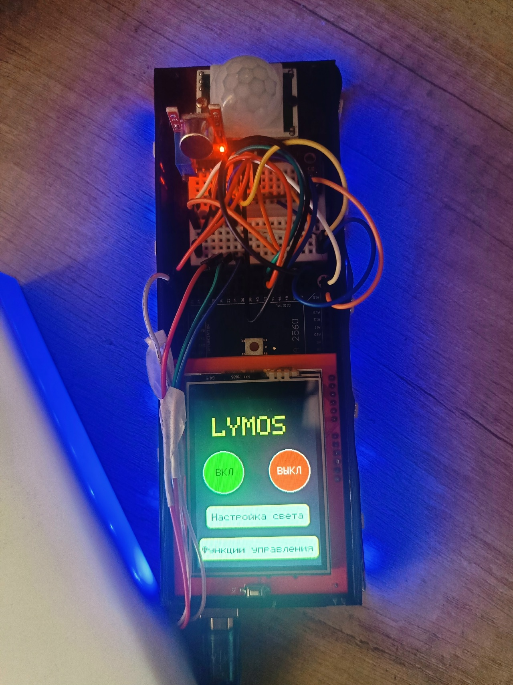

# Lumos Lighting Layout

> **Умное освещение, которое подстраивается под вас**

---

## Оглавление

- [Описание проекта](#описание-проекта)
- [Функциональные возможности](#функциональные-возможности)
- [Аппаратная часть](#аппаратная-часть)
  - [Компоненты](#компоненты)
  - [Схема подключения](#схема-подключения)
- [Программное обеспечение](#программное-обеспечение)
  - [Используемые библиотеки](#используемые-библиотеки)
  - [Структура программы](#структура-программы)
- [Установка и запуск](#установка-и-запуск)

---

## Описание проекта

**Lumos** — это макет интеллектуальной системы управления освещением.


### Актуальность

> *"Технологии умного дома перестали быть фантастикой — они становятся необходимостью. Однако большинство устройств на рынке выполняют лишь базовые сценарии, не раскрывая своего потенциала."*

### Цель проекта

Разработать макет устройства управления освещением на базе концепции **«Умный дом»**.

### Задачи проекта

- [x] Исследовать технологии, применяемые в системах «Умного дома»
- [x] Разработать проект макета — «Lumos»
- [x] Продумать функции, выполняемые макетом
- [x] Выбрать компоненты и разработать структурную схему
- [x] Создать принципиальную электрическую схему
- [x] Создать действующий образец макета
- [x] Написать программу для создаваемого макета

---

## Функциональные возможности

Устройство поддерживает **5 режимов** управления освещением:

1. **Ручной** — Включение/выключение и настройка через сенсорный TFT-экран
2. **Планинг дня** — Автоматическое изменение цвета и яркости по расписанию
3. **По звуку** — Включение/выключение света по хлопку
4. **По движению** — Автоматическое включение при обнаружении движения
5. **По освещенности** — Включение при низком уровне естественного света

### Настройки света

- **Цвет**: выбор из 8 предустановленных цветов
- **Яркость**: регулировка от 0 до 255
- **Теплота**: настройка цветовой температуры (Ke)

---

## Аппаратная часть

### Компоненты

| Компонент | Модель | Назначение |
|:----------|:-------|:------------|
| **Микроконтроллер** | Arduino Mega 2560 | Основной контроллер |
| **Дисплей** | TFT 2.4" (320x240) | Сенсорный интерфейс |
| **Источник света** | RGB светодиод (общий катод) | Имитация лампы |
| **Датчик движения** | HC-SR501 | Инфракрасный датчик |
| **Датчик звука** | Высокочувствительный микрофон | Реагирование на хлопок |
| **Датчик освещенности** | Аналоговый датчик | Измерение уровня света |

---

## Схема подключения

### RGB светодиод
- Красный (R) → Pin 44 (PWM)
- Зеленый (G) → Pin 45 (PWM)
- Синий (B) → Pin 46 (PWM)
- Общий катод → GND

### Датчик движения (HC-SR501)
- VCC → 5V
- GND → GND
- OUT → Pin 48

### Датчик звука
- VCC → 5V
- GND → GND
- Аналоговый → A15 (14)
- Цифровой → Pin 47

### Датчик освещенности
- VCC → 5V
- GND → GND
- Аналоговый → A14 (13)

### TFT дисплей 2.4"
Дисплей устанавливается на штатные разъемы платы Arduino Mega. Пины управления (CS, CD, WR, RD, RESET) и тачскрина (XP, YP, XM, YM) настраиваются программно через библиотеку.

---

## Программное обеспечение

### Используемые библиотеки

```cpp
#include <SPFD5408_Adafruit_GFX.h>     // Графическая библиотека
#include <SPFD5408_Adafruit_TFTLCD.h>  // Работа с экраном
#include <SPFD5408_TouchScreen.h>      // Сенсорный экран
#include <GRGB.h>                      // Управление RGB светодиодом
```
---

### Структура программы
Программа построена на основе конечного автомата с режимами (Regim):

- **0** — Заставка / Инициализация
- **1** — Главное меню
- **2** — Настройка планирования дня
- **3** — Выполнение планирования дня
- **4** — Настройка света (цвет, яркость, теплота)
- **5** — Меню функций управления
- **6** — Датчик звука
- **7** — Датчик движения
- **8** — Датчик освещенности
---
```cpp
Пример кода (управление RGB)
// Инициализация RGB светодиода
GRGB led(COMMON_CATHODE, 44, 45, 46);

// Установка параметров
led.setColor(WHITE);       // Установка цвета
led.setBrightness(255);    // Яркость (0-255)
led.setKelvin(3224);       // Цветовая температура
led.enable();              // Включение
led.disable();             // Выключение
```
---

## Установка и запуск
### Требования
Arduino IDE (версия 1.8.19 или новее)

Плата: Arduino Mega 2560

Библиотеки: см. раздел Используемые библиотеки

Инструкция
Скачайте или склонируйте репозиторий.

Установите необходимые библиотеки через менеджер библиотек Arduino IDE.

Подключите Arduino Mega к компьютеру через USB.

Выберите плату: Tools → Board → Arduino Mega 2560.

Загрузите скетч: кнопка → (Upload).

Используйте сенсорный экран для управления!

*Примечание: В демонстрационном режиме время ускорено: 1 час = 1 секунде.*
